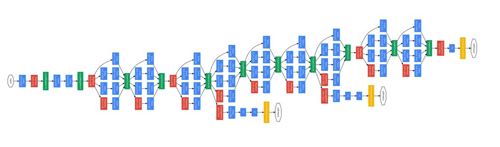
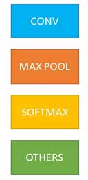

# Famous CNN Architectures #1
This repository contains code as well as first edit of the blog available [here](https://predictiveprogrammer.com/famous-convolutional-neural-network-architectures-1/).

## Architectures Discussed

### LeNet
||
|:-------------------:|
|*Source:  [Gradient based learning applied to document recognition fig 2](http://yann.lecun.com/exdb/publis/pdf/lecun-01a.pdf)*|

### AlexNet
||
|:---------------------:|
|*Source: [ImageNet Classification with Deep Convolutional Neural Networks fig 2](https://papers.nips.cc/paper/4824-imagenet-classification-with-deep-convolutional-neural-networks.pdf)*|

### VGGNet

### Inception/GoogLeNet
|||
|:-------------------------------:|:-:|
|*Src: [Going deeper with convolutions](https://arxiv.org/pdf/1409.4842.pdf)*||

### ResNet
||
|:--------------------:|
|*34 layer deep ResNet. Source: [Deep Residual Learning for Image Recognition](https://arxiv.org/pdf/1512.03385.pdf)*|
